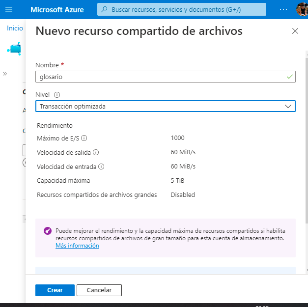
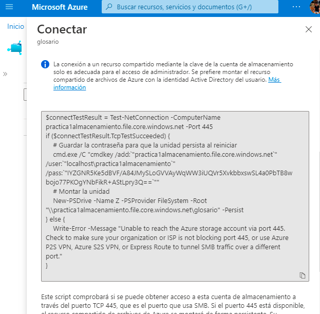

# Practica 2 Sesion 6
Implementación de los servicios de Azure File Storage

- EL primer paso es ir a la sección de recursos compartidos de archivos y crear un recurso.

- Después importaremos un archivo cualquiera y daremos clic en conectar lo cual nos generara un grupo de comandos.

- Este grupo de comandos lo copiamos y pegamos en el Power Shell de Windows generandonos así el uso compartido de archivos con Azure.

---
Autor: Rogelio Clemente Balderas

Fecha: 10/07/2022

Requisitos:
- Azure Storage
- Azure File Storage

---